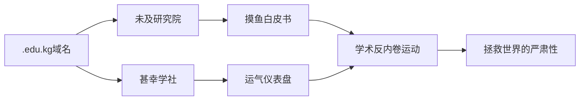

# 始料未及，如此甚幸

> 「未及」的学术宇宙：一个荒诞又真实的域名艺术项目

<p align="center">
  
  
</p>

## 学术双生子：未及 vs 甚幸

| **项目**       | **哲学核心**                     | **视觉风格**         | **生存指南**                     |
|----------------|----------------------------------|---------------------|----------------------------------|
| **[未及研究院](https://ne.edu.kg/)**<br>(NE.EDU.KG) | "抵达是例外，未及是常态"          | 极简淡蓝 · 未完成美学 | 优雅躺平 · 进度条永驻47%           |


## 诞生记：从 Not Even 到 Not Ending 



## 快速导航

### 未及 (Not Even)
- 官网主页：[https://ne.edu.kg](https://ne.edu.kg/)
- 核心课题：
  - 《能量守恒式学习法》
  - 《未完成美学评估体系》
  - 《认知资源动态分配学》
- 特色功能：47%进度条永恒美学


## 技术揭秘

```bash
.
├── ne/                        # 未及研究院官网
│   └── index.html             # 主入口文件
│       ├── css/               # 未完成美学
│       └── js/                # 粒子动画系统
│
└── README.md                  # 本项目说明书
```

## 人间真实使用场景

1. **教育福利申请**
   - 用 `admin@ne.edu.kg` 申请 Notion 教育版
     → 备注："研究未完成知识管理"

2. **学术答辩话术**
   - 未及派："本课题采用渐进式未完成策略..."

3. **精神自救指南**
   - 压力大时打开 [未及研究院](https://ne.edu.kg/) → 看进度条停在47%

## 贡献指南

欢迎提交你的「未完成」与「小确幸」：

```markdown
未完成作品投递区：
   - 只有README的GitHub仓库
   - 写了三章的科幻小说
   - 画了线稿的插画
   → 存放至 `ne/incomplete-museum/`

```

## 哲学结语

> "始料未及的是灵感降临的方向  
> 如此甚幸的是有人陪你疯一场  
> 在完成与未完成的量子叠加态中  
> 我们找到了对抗荒诞的最佳姿势"

<p align="center">
  
  
  
  
</p>

---

**未及** 
学术反内卷阵线联盟 | 2025年·摸鱼纪元
